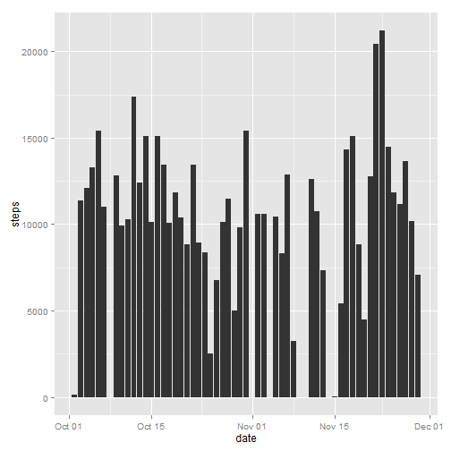

# Reproducible Research: Peer Assessment 1

```r
# Use ggplot2
library(ggplot2)
```


## Loading and preprocessing the data

```r
# Read directly from the .zip file
df <- read.csv(unz("activity.zip", "activity.csv"))
# Convert "date" field values to Date class
df$date <- as.Date(df$date, format="%Y-%m-%d")
```

## What is mean total number of steps taken per day?

```r
# Calculate total steps per day
totalByDay <- aggregate(steps ~ date, df, sum, na.rm = TRUE)
# Plot the histogram
qplot(date, steps, data = totalByDay, geom = "histogram", stat="identity")
```

 


```r
# Calculate mean and median total number of steps taken per day
dMean = mean(totalByDay$steps)
dMedian = median(totalByDay$steps)
```

* Mean total number of steps taken per day: **10766.19**
* Median total number of steps taken per day: **10765**


## What is the average daily activity pattern?


```r
# Calculate average number of steps for every 5-min period accross all days
avgPerInterval <- aggregate(steps ~ interval, df, mean, na.rm = TRUE)
# Plot the time series
g <- ggplot(avgPerInterval, aes(interval, steps)) + geom_line() 
g <- g + ylab("Average steps across all days")
# Find out which 5-minute interval, on average across all the days
# in the dataset, contains the maximum number of steps
maxStepsInterval = (subset(avgPerInterval, steps == max(avgPerInterval$steps)))$interval
# Mark it with a vertical line on the graph
g <- g + geom_vline(xintercept = maxStepsInterval, colour = "red", linetype = "longdash")
print(g)
```

 

* The 5-minute interval, on average across all the days that contains the maximum number of steps: **835**

## Imputing missing values


```r
missingValues = sum(is.na(df$steps))
```

* Number of missing values: 2304


```r
# Make a copy of the original data frame
df2 <- df
# Replace NA values with average daily values calculated above
for (i in 1:nrow(df2)) {
    if(is.na(df2[i, "steps"])) {
        df2[i, "steps"] <- (subset(avgPerInterval, interval == df2[i, "interval"]))$steps
    }
}
# Calculate total steps per day
totalByDay2 <- aggregate(steps ~ date, df2, sum, na.rm = TRUE)
# Plot the histogram
qplot(date, steps, data = totalByDay2, geom = "histogram", stat="identity")
```

 

```r
# Calculate mean and median total number of steps taken per day
dMean2 = mean(totalByDay2$steps)
dMedian2 = median(totalByDay2$steps)
```

* Mean total number of steps taken per day: **10766.19**
* Median total number of steps taken per day: **10766.19**

Imputing of missing data (replacement of NAs with average daily values) had no effect on the mean and almost no effect on the median.

## Are there differences in activity patterns between weekdays and weekends?


```r
# Add daytype column and fill it with weekday names
df2$daytype <- weekdays(df2$date)
# Convert weekday names to "weekend"/"weekday"
df2$daytype <- as.factor(ifelse((df2$daytype == "Saturday" | df2$daytype == "Sunday"), "weekend", "weekday"))

# Calculate average number of steps for every 5-min period accross all days
# Account for weekend/weekday split this time
avgPerInterval2 <- aggregate(df2$steps, list(df2$interval, df2$daytype), mean, na.rm = TRUE)
colnames(avgPerInterval2) <- c("interval", "daytype", "steps")
# Plot the time series
g <- ggplot(avgPerInterval2, aes(interval, steps)) + geom_line() 
g <- g + facet_grid(daytype ~ .)
g <- g + ylab("Average steps across all days")
print(g)
```

 
